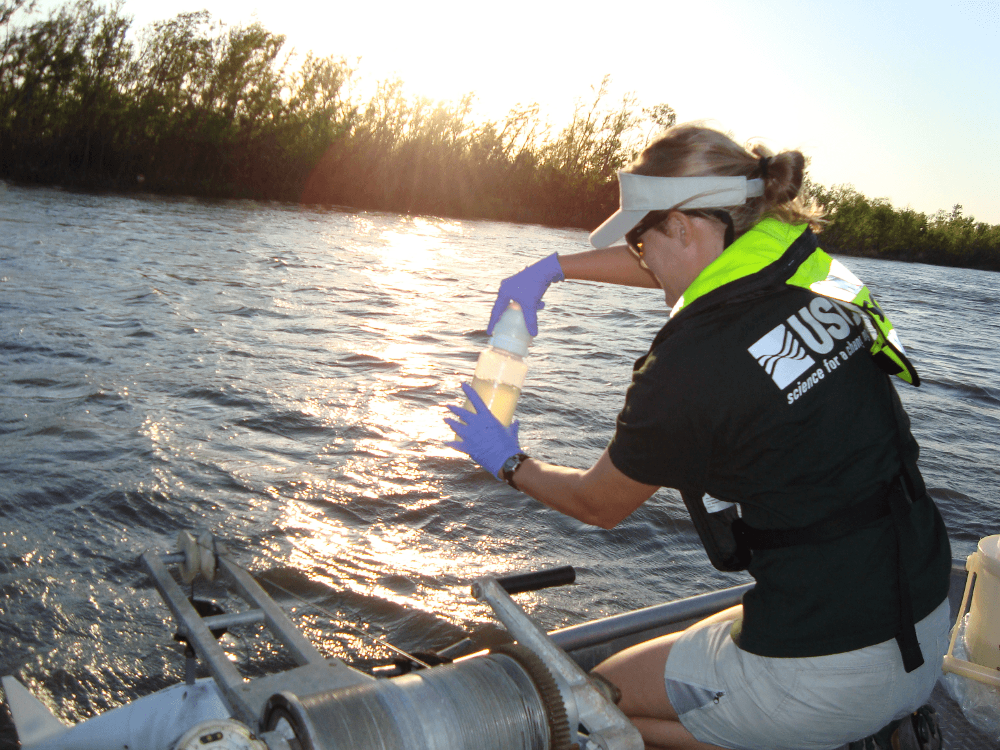

```{r}
#get data
library(dataRetrieval)
library(dplyr)

sites <- c("08067252", "08067230", "294815094444200", "08162501", "08188810", "08211502", "0821150305", "08072050", "08211500")

parm<-c("00061", "00010", "00095", "00300", "00400", "63680", "00600", "00605", "00607", "00608", "00618", "00613","00625", "00665", "00660", "00671", "00680", "00681", "62855", "62854", "70331", "80154")

start.date<- "2009-10-01"
end.date<- Sys.Date()

data<- readNWISqw(siteNumbers= sites, 
                 parameterCd= parm, 
                 startDate = start.date,
                 endDate = end.date, reshape = TRUE)
data<- renameNWISColumns(data)

siteInfo <- attr(data, "siteInfo") #obtain site attributes
data$site_nm<-siteInfo[match(data$site_no, siteInfo$site_no), 3] #match site numbers betwwen dataset to obtain station names

#adding a columns with watershed names based on site number
data$basin <- ifelse(data$site_no == "08067252" | data$site_no == "08067230" | data$site_no == "294815094444200", 'Trinity River', ifelse(data$site_no == "08162501", 'Colorado River', ifelse(data$site_no =="08188810", 'Guadalupe River', ifelse(data$site_no=="08072050","San Jacinto River", 'Nueces River'))))

sitelist<-c(unique(data$basin)) #get a list of basin names


```

Project Overview {data-orientation=rows}
==============================

Row {data-height=800}
-----------------------------

### Frame 1
```{r}
HTML(
  "<h2 id='project-title'> Evaluating Freshwater Inflow and Nutrient and Sediment Loading into Bays and Estuaries in Texas </h2>
  
  
  <section id='desc-text'> <p id='description'> The U.S. Geological Survey (USGS), in cooperation with the Texas Water Development Board and the Galveston Bay Estuary Program, monitors nutrient and sediment concentrations and loads entering Texas bays and estuaries over a range of hydrologic conditions in four major River systems: Trinity River, Colorado River, Guadalupe-San Antonio River, and Nueces River. Streamflow is measured through index-velocity techniques and water-quality samples are collected during high flow and base flow conditions to improve our understanding of the quantity and quality of freshwater inflow to Texas bays and estuaries. Surrogate regressions are also developed to obtain a continuous record of sediment and nutrient concentrations in these watersheds. </p> </section>  "
)

```


Row {data-height=500}
---------------------------

### Frame 2

### Frame 3


Data by Watershed
=====================================


Sidebar {.sidebar}
---------------------------------

```{r Inputs}
#get site number

selectInput("station", "Select Watershed", choices = sitelist, selected =sitelist[1])


dateRangeInput("dates","Select Date Range for Water Quality Data",
                     start="2009-10-01",
                     end = (Sys.Date()))

#downloadButton("downloadData", "Download Selected Data")

# Downloadable csv of selected dataset ----
downloadHandler(
    filename = function() {
      paste(input$station, ".csv", sep = "")
    },
    content = function(file) {
      write.csv(datatable(), file, row.names = FALSE)
    }
  )

tags$br()
tags$br()

```

Links to Available Real-Time Data:
```{r } 
HTML(
  "<ul>
    <li><a href='https://waterdata.usgs.gov/tx/nwis/uv?cb_00060=on&cb_00065=on&format=gif_default&site_no=08067252' target='_blank'>Trinity River</a> </li>

    <li> <a href='https://waterdata.usgs.gov/tx/nwis/uv?cb_00060=on&cb_00065=on&cb_99409=on&format=gif_default&site_no=08188810' target='_blank'>Guadalupe River</a> </li>

  <li> <a href='https://waterdata.usgs.gov/nwis/uv?cb_00010=on&cb_00060=on&cb_00065=on&format=gif_default&site_no=08162501' target='_blank'>Colorado River</a> </li>
  <ul>")

```

  

Row {data-height=500}
-------------------------------------

### Watershed Data Table

```{r}


data_short <- data %>% 
  select("site_no", "site_nm", "basin", "sample_dt", "sample_tm",  starts_with("result_va"), starts_with("remark_cd"))

data_short <- data_short[,c("site_no", "site_nm","basin" , "sample_dt", "sample_tm", "result_va_00061",  "result_va_00010", "result_va_00095",
                           "result_va_00300", "result_va_00400", "remark_cd_00605","result_va_00605","remark_cd_00608",
                           "result_va_00608","remark_cd_00613","result_va_00613","remark_cd_00618","result_va_00618",
                           "remark_cd_00607","result_va_00607", "remark_cd_00600","result_va_00600","remark_cd_00671","result_va_00671", "result_va_00665",  "result_va_62855",  "result_va_62854","result_va_63680", "result_va_70331", "result_va_80154", "result_va_00680", "result_va_00681")]

#colnames(data_short) <- c("site_no", "site_nm", "basin", "sample_dt", "sample_tm", "00061",  "00010", "00095",
              #             "00300", "00400", "remark_cd_00605","00605","remark_cd_00608",
               #            "00608","remark_cd_00613","00613","remark_cd_00618","00618",
                    #       "remark_cd_00607","00607", "remark_cd_00600","00600","remark_cd_00671","00671", "00665",  "62855",  "62854","63680", "70331", "80154", "00680", "00681")


data_table <- data_short 

ite_nm<-siteInfo[match(data$site_no, siteInfo$site_no), 3]

data_table<- reactive({
    data_short %>%
    filter(sample_dt >= input$dates[1],
           sample_dt <= input$dates[2],
           basin %in% input$station)
})

cols <- c("Station Number",
                          "Station Name", 
                          "Basin", 
                          "Sample Date",
                          "Sample Time" ,
                          "Stream flow, instantaneous (ft3/s)",	
                          "Temperature, water (deg C)",	
                          "Specific conductance (uS/cm @25C)",	
                          "Dissolver oxygen (mg/l)",	
                          "pH (std units)",	
                          "Total organic nitrogen remark code", 
                          "Total organic nitrogen (mg/l)",	
                          "Ammonia and ammonium remark code",	
                          "Ammonia and ammonium (mg/l as N)",	
                          "Nitrite remark code	Nitrite (mg/l as N)",	
                          "Nitrate remark code	Nitrate (mg/l as N)",
                          "Dissolved organic nitrogen remark code",	
                          "Dissolved organic nitrogen (mg/l)",
                          "Total Nitrogen remark code",	
                          "Total Nitrogen (mg/l)",
                          "Phosphate as PO4 remark code",	
                          "Phosphate (mg/l as PO4)",
                          "Phosphate as P remark code",
                          "Phosphate (mg/l as P)",	
                          "Total phosphorus (mg/l as P)",	
                          "Total nitrogen (persulfate method) (mg/l)",	
                          "Total Dissolved nitrogen (persulfate method) (mg/l)",	
                          "Turbidity (FNU)",	
                          "Suspended sediment concentration (SSC) (% smaller than 0.0625mm)",	
                          "Suspended sediment concentration (SSC) (mg/l)",	
                          "Total organic carbon (mg/l)",	
                          "Dissolved organic carbon (mg/l)")

#cols <- c()


library(DT)
output$table <- DT::renderDataTable({
  datatable(data_table(),  
    colnames = cols,  
    rownames= FALSE, 
    options =list(
      autoWidth = TRUE,
      columnDefs = list(list(width = '600px', targets = c(18, 19))),
      pageLength = 15))
})


DTOutput('table')

```

Row {data-height=500}
-------------------------------------
   
### Station Map 

```{r}
library(leaflet)

info<- attr(data, "siteInfo")

info$basin<- ifelse(info$site_no == "08067252" | info$site_no == "08067230" | info$site_no == "294815094444200", 'Trinity River', ifelse(info$site_no == "08162501", 'Colorado River', ifelse(info$site_no =="08188810", 'Guadalupe River', ifelse(info$site_no=="08072050","San Jacinto River", 'Nueces River'))))


  site <- reactive({
    info %>%
    filter(basin == input$station)
  })
  


output$map <- 
  renderLeaflet({
   map<- leaflet(site()) %>% 
    addProviderTiles(providers$Esri.WorldTopoMap) %>%
    setView(lat=site()$dec_lat_va[1], lng=site()$dec_long_va[1], zoom = 11)%>%
    addMarkers(lat = ~dec_lat_va, lng =~dec_long_va, label = ~as.character(station_nm))
    
    #map %>% setView(map, lat=~site$dec_lat_va, lng=~site$dec_long_va, zoom = 10)
  

 })
  
leafletOutput('map') 

```   
    
### 14-day Hydrograph

```{r}
library(plotly)

#get data from dataretreival
sites<- c("08067252", "08162501", "08188810", "08211500", "08072000")

start.date<- Sys.Date() - 14
end.date<- Sys.Date()

Q<- readNWISuv(siteNumbers= sites, 
                 parameterCd= c("00060","00065"), #Discharge
                 startDate = start.date,
                 endDate = end.date)

Q$basin <- ifelse(Q$site_no == "08067252", "Trinity River", 
                       ifelse(Q$site_no == "08162501", "Colorado River", ifelse(Q$site_no == "08188810", "Guadalupe River", 
                          ifelse(Q$site_no == "08072000", "San Jacinto River", "Nueces River"))))


Q$st_nm<- ifelse(Q$site_no == "08067252", "Trinity River at Wallisville, TX", 
                       ifelse(Q$site_no == "08162501", "Colorado River near Wadsworth", ifelse(Q$site_no == "08188810", "Guadalupe Rv at SH 35 nr Tivoli, TX", 
                          ifelse(Q$site_no == "08072000", "San Jacinto Rv nr Sheldon, TX", "Nueces Rv at Calallen, TX"))))


siteQ <- reactive({
  Q %>%
  filter(basin == input$station)
  })

output$plot <- 
  renderPlotly({plot_ly(siteQ(), x=~dateTime) %>%
      add_trace(y=~X_00060_00000, type="scatter", mode ="lines", line =list(color = 'rgba(rgb(78, 66, 244,1)')) %>%
      layout(
        title = paste("USGS Station", siteQ()$site_no[1], siteQ()$st_nm[1]),
        xaxis = list(title = "Date"),
        yaxis = list(title = "Stremalfow, in cubic feet per second")
      )
})

plotlyOutput('plot')


```
